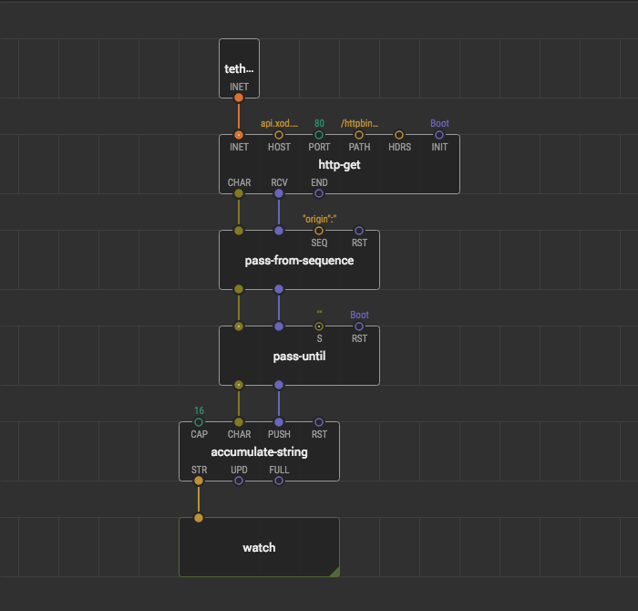
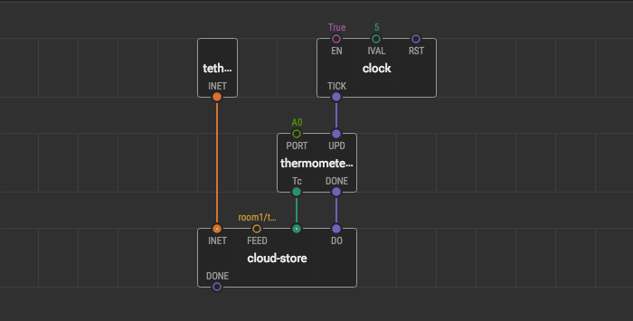
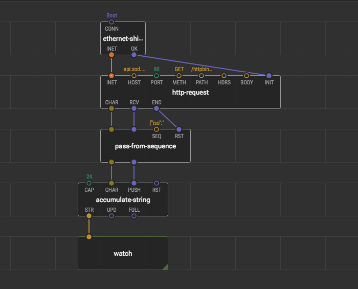

# Using the internet from PC

There is a large class of tasks, called Internet-Of-Things when the hardware needs an Internet connection to send or receive data from some server. For example, log the temperature and moisture for smart greenhouses, getting the current time, weather, work with [XOD Cloud API](/docs/guide/getting-started-with-feeds/) or other APIs, and so on.

Some microcontrollers can access the internet on its own, like [ESP8266](/docs/guide/esp8266-connect/), or with the connected modules or shields, like [W5500 ethernet shield](https://xod.io/libs/xod-dev/w5500/) or [ESP8266 in AT commands mode](https://xod.io/libs/xod-dev/esp8266/). But if you have a microcontroller without internet support at your hands or no microcontroller at all, XOD has a solution for you: use [`xod/debug/tethering-inet`](https://xod.io/libs/xod/debug/tethering-inet/) node to provide the internet from your PC to your microcontroller via Serial or use it in the simulation.

Note

The tethering internet feature uses low-level internet communication, which is supported by OS, but not provided in the browser. So it works only in a desktop version of the XOD IDE.

## Fetching data from the internet

To represent the benefit of the tethering internet, we take an example from the [guide of HTTP GET request](/docs/guide/http-get/) and modify it a little bit:
Replace the internet provider node with the `xod/debug/tethering-inet` node.
Replace the text LCD node with a [`xod/debug/watch`](https://xod.io/libs/xod/debug/watch/), to get rid of any hardware in the program.

That is, simulate the program or upload it with the turned on debug mode. It works the same as in the example on your Arduino Uno or even in a simulation. Wait for a little, and you get your remote IP address in the watch node.

## Sending data to the internet

Sending data to the internet works the same as getting data, but usually, it uses POST or PUT methods of an HTTP request. We took an example from the guide about XOD Cloud Feeds and modify it a little bit by replacing the `connect` node with `tethering-inet`.

Note

This example gets a value from the thermometer, but if you have no thermometer or microcontroller at all, you can replace it with [`xod/debug/tweak-number`](https://xod.io/libs/xod/debug/tweak-number/) and change this value manually.

If you have signed in and ran the program, you’ve got some temperature values in your feed.

## To the production

After you wrote and test the program with the `tethering-inet` node, you might want to use your device without a connected PC. It’s time to replace `tethering-inet` with the suitable node for module or microcontroller, which you have at your hands.

And it keeps working, but without PC at all.

---

1. For debugging and developing the program with some interactions with the internet, you can share the internet from your PC to your program by using the `xod/debug/tethering-inet` node.
2. It works in the simulation without any microcontroller and modules at all.
3. This node is not for production and operating only with a connected PC. Do not forget to replace it with a suitable internet provider when your program is ready for production.
